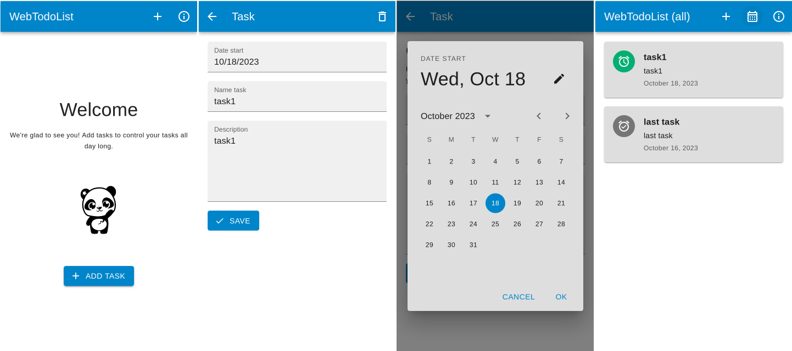

# Web TodoList

Web TodoList — это пример приложения, позволяющего управлять задачами,
который включает в себя:
- Создание задач
- Редактирование их
- Просмотр всех задач
- Просмотр задач на сегодня

Основная цель этого примера — продемонстрировать работу фреймворка WebView с приложением, написанным на React,
и взаимодействие между ними через систему событий.

### React

* Приложение, написанное с использованием MUI.
* Используется react-lottie.
* Используется react-router-dom.
* formik + yup forms.
* Два языка en_EN и ru_RU.
* Диалог для выбора даты MUI.
* Работает независимо в браузере.
* Настройка для локальной работы в ОС Аврора.
* Используется LocalStorage, есть синхронизация данных с ОС Аврора.
* Список событий для обмена данных React <-> ОС Аврора.
* Синхронизация цветовых схем MUI и атмосфер ОС Аврора.
* Восстановление данных после открытия приложения.

### Аврора

* Приложение использует Sailfish.WebView 1.0.
* Отправка атмосферных UI данных в веб-приложение.
* Отправка локали в веб-приложение.
* Восстановление данных после открытия приложения.
* Сохранение данных, отправленных из React при изменении.

## Условия использования и участия

Исходный код проекта предоставляется по [лицензии](LICENSE.BSD-3-Clause.md),
которая позволяет использовать его в сторонних приложениях.

[Соглашение участника](CONTRIBUTING.md) регламентирует права,
предоставляемые участниками компании «Открытая Мобильная Платформа».

Информация об участниках указана в файле [AUTHORS](AUTHORS.md).

[Кодекс поведения](CODE_OF_CONDUCT.md) — это действующий набор правил
компании «Открытая Мобильная Платформа»,
который информирует об ожиданиях по взаимодействию между членами сообщества при общении и работе над проектами.

## Структура проекта

Проект имеет стандартную структуру приложения на базе C++ и QML для ОС Аврора.

* Файл **[ru.auroraos.WebTodoList.pro](ru.auroraos.WebTodoList.pro)** описывает структуру проекта для системы сборки qmake.
* Каталог **[icons](icons)** содержит иконки приложения для поддерживаемых разрешений экрана.
* Каталог **[qml](qml)** содержит исходный код на QML и ресурсы интерфейса пользователя.
  * Каталог **[cover](qml/cover)** содержит реализации обложек приложения.
  * Каталог **[icons](qml/icons)** содержит дополнительные иконки интерфейса пользователя.
  * Каталог **[js](qml/js)** содержит вспомогательные скрипты.
  * Каталог **[models](qml/models)** содержит модели.
  * Каталог **[pages](qml/pages)** содержит страницы приложения.
  * Каталог **[react](qml/react)** содержит статически собранное приложение на React.
  * Каталог **[services](qml/services)** содержит сервисы.
  * Файл **[WebTodoList.qml](qml/WebTodoList.qml)** предоставляет реализацию окна приложения.
* Каталог **[rpm](rpm)** содержит настройки сборки rpm-пакета.
  * Файл **[ru.auroraos.WebTodoList.spec](rpm/ru.auroraos.WebTodoList.spec)** используется инструментом rpmbuild.
* Каталог **[src](src)** содержит исходный код на C++.
  * Файл **[main.cpp](src/main.cpp)** является точкой входа в приложение.
* Каталог **[translations](translations)** содержит файлы перевода интерфейса пользователя.
* Файл **[ru.auroraos.WebTodoList.desktop](ru.auroraos.WebTodoList.desktop)** определяет отображение и параметры запуска приложения.

## Совместимость

Проект совместим с актуальными версиями ОС Аврора.

## Сборка проекта

Проект собирается обычным образом с помощью Аврора SDK.
Приложение на React собрано статически на node v18.18.1 LTS, npm v9.8.1 с ключом `--openssl-legacy-provider`.

## Снимки экранов

## This document in English

- [README.md](README.md)
